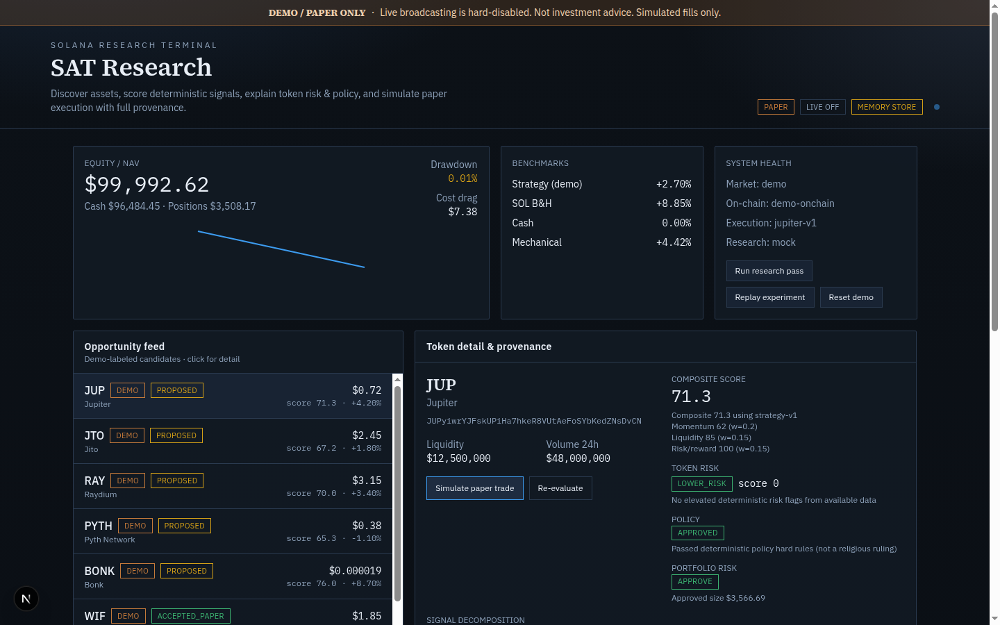

# SAT Research — Solana Agentic Trading Research Platform

**READ_ONLY + PAPER ONLY.** Live swap broadcasting is hard-disabled.

Professional research terminal for Solana asset discovery, deterministic signals, explainable token-risk, configurable policy checks, bounded LLM research, portfolio risk gates, Jupiter quote/plan (no broadcast), and realistic paper execution with full decision provenance.

> Not investment advice. Not a fatwa authority. Risk tiers never use the label “SAFE”.

## Architecture

```text
┌─────────────────────────────────────────────────────────────────┐
│ apps/web (Next.js dashboard)     apps/worker (batch cycles)     │
└───────────────┬───────────────────────────┬─────────────────────┘
                │                           │
                ▼                           ▼
         packages/pipeline (orchestrator) ─────────────┐
                │                                      │
    ┌───────────┼────────────┬─────────────┬───────────┼──────────┐
    ▼           ▼            ▼             ▼           ▼          ▼
 discovery  signals   token-risk   policy-engine  risk-engine  research
    │           │            │             │           │          │
    └───────────┴────────────┴──────┬──────┴───────────┴──────────┘
                                    ▼
                     execution (Jupiter quote/plan)
                                    ▼
                          paper-trading + portfolio
                                    ▼
                     analytics + experiments + database
```

## Quick start

```bash
pnpm install
cp .env.example .env.local   # optional credentials
pnpm --filter @sat/web run dev
```

Open [http://127.0.0.1:4317](http://127.0.0.1:4317). The default bind is **loopback** (`127.0.0.1`). For a remote demo bind, use `pnpm --filter @sat/web run dev:remote-demo` and set `SAT_ALLOWED_ORIGINS`. Demo data is labeled in the UI banner.

```bash
pnpm exec vitest run          # unit + integration
pnpm lint                    # real ESLint: packages, worker, tests, and @sat/web
pnpm --filter @sat/web run build
pnpm exec playwright test   # critical DEMO/PAPER UI+API flow
pnpm --filter @sat/worker run start
```

## Operating modes

| Mode | Behavior |
|------|----------|
| `DEMO` | In-memory demo market data + mock research |
| `PAPER` | Quotes may hit Jupiter; fills are simulated only |
| `READ_ONLY` | Research without paper fills |
| `LIVE` | **Remapped to PAPER** — broadcast is not implemented |

Env unlock vars (`ALLOW_LIVE_TRADING`, `OPERATING_MODE=LIVE`, `LIVE_BROADCAST_UNLOCK`) are reserved for a future audited path; `isLiveTradingAllowed()` hard-returns `false` in V1.

## Environment variables

See [`.env.example`](./.env.example). Optional: `JUPITER_API_KEY`, `HELIUS_API_KEY`, `BIRDEYE_API_KEY`, `OPENAI_API_KEY`, `DATABASE_URL`. Missing credentials → labeled DEMO/mock adapters.

## Packages

| Package | Role |
|---------|------|
| `@sat/shared` | Zod schemas, defaults, demo assets, safety helpers |
| `@sat/market-data` | MarketDataProvider (Birdeye + DEMO) |
| `@sat/solana` | OnChainProvider (Helius DAS getAsset + DEMO) |
| `@sat/discovery` | Candidate discovery + Zod validation |
| `@sat/signals` | Snapshot + historical OHLCV (momentum/volume/vol/RS/breakout) |
| `@sat/token-risk` | Deterministic risk score/tiers/flags (v1.5 DAS mapping) |
| `@sat/policy-engine` | APPROVED / REJECTED / MANUAL_REVIEW |
| `@sat/research-agent` | Bounded LLM / mock + injection guards |
| `@sat/risk-engine` | Portfolio risk APPROVE/REJECT/REDUCE_SIZE |
| `@sat/execution` | Jupiter Swap API v1 quote/plan, never broadcast |
| `@sat/paper-trading` | Spread/slippage/impact/latency/partial/fail model |
| `@sat/portfolio` | NAV, sizing helpers |
| `@sat/analytics` | Returns, Sharpe/Sortino w/ sample warnings |
| `@sat/experiments` | Observed paper equity replay; hides short-history metrics |
| `@sat/database` | In-memory fallback + Postgres when `DATABASE_URL` is set |
| `@sat/pipeline` | End-to-end orchestration |

## Safety

- No seed phrases / wallet secrets
- No live transaction broadcast
- No leverage, margin, perps, options, prediction markets
- LLM cannot override policy/risk/portfolio
- External text treated as UNTRUSTED

See [SECURITY.md](./SECURITY.md) and [docs/threat-model.md](./docs/threat-model.md).

## Docs

- [Architecture](./docs/architecture.md)
- [Methodology](./docs/methodology.md)
- [Signals / min history](./docs/signals.md)
- [Token risk](./docs/token-risk.md)
- [Policy engine](./docs/policy-engine.md)
- [Risk engine](./docs/risk-engine.md)
- [Paper trading](./docs/paper-trading.md)
- [Experiments](./docs/experiments.md)
- [Limitations](./docs/limitations.md)
- [Resume notes](./docs/resume-project-notes.md)
- [Handoff](./HANDOFF.md)
- [V1.5 handoff](./docs/V1.5-HANDOFF.md)
- [Adversarial audit (Grok)](./docs/AUDIT-GROK.md)
- [Next-steps planning handoff](./docs/NEXT-STEPS-HANDOFF.md)

## Screenshots / demo



Run the dashboard locally (`pnpm --filter @sat/web run dev`). The first viewport shows **SAT Research** branding, DEMO/PAPER banner, NAV, opportunity feed, and provenance panels.

## Roadmap

1. Hosted Postgres/Supabase in a real demo environment (adapter is implemented; needs `DATABASE_URL`)
2. Broader Token-2022 coverage when DAS/RPC actually return extension bytes
3. Jupiter Swap API v2 quotes (still quote-only)
4. Optional hardware-wallet LIVE path behind additional human gates (not this release)

## License

Private research prototype — use at your own risk.
